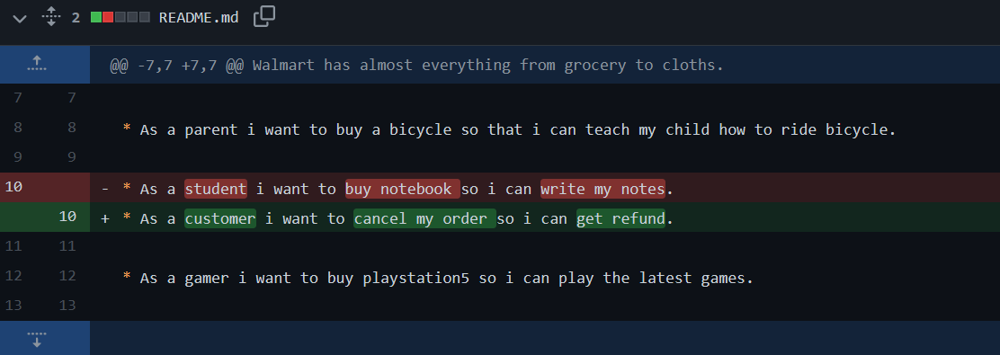
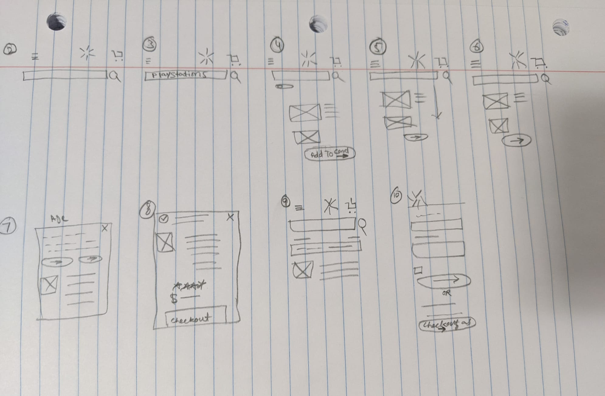
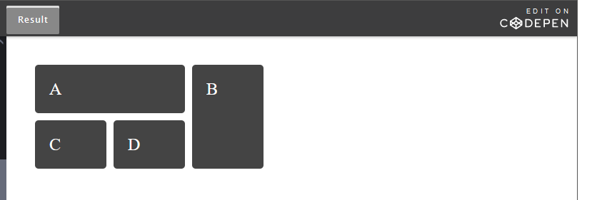

# codejournal
this is simple journal.

## Jan 12,2022
Goal: write a code journal
* First try to write a journal. looking good.I created a repo named:codejournal and added file README.md by git add . I was not able to copy link to my terminal. I asked for help from tony. Then i made some changes init checked my status  using git status and then i pushed it to github by Git push.

* i thought it worked looks like im stuck
* omg i dont know what to do
* i forgot to save the file so git did not see any changes
* yea i got it

Goal: giving a theme 
* just looked up for some basic syntax to make my journal pretty.I am hoping i don't make any mistakes there.

* forgot to save again ahhhh

Goal: working on webpage

* Just created a folder "hello"
* Added a file "index.html"
* Having some trouble adding my code in terminal
* My folder "hello" was not on my github so i was having problem
* I got help from tony
* Used git init created a repository
* Added ssh keys
## Jan 17/2022-20/2022
Goal: working on agile ux breakdown

* Looking for mobile app.
   * Created a new repo name `dsgn270-a1` on GH
   * Cloned the repo to my local directory ->`git clone` [dsgn--a1](https://github.com/maryambkhan/dsgn270-a1.git)
   * Added README.md file `git add .`
* Still thinking of good scenario to write user story
* I just figured out my user story
* I am going to write about `wallmart`
* I have created a rough sketch of my user story on paper
* Now I am going to add it to my repo `dsgn270-a1` 
* I just set `##H heading` and git add . ,git commit -m"" and git push. As always no changes becouse i was not in right file.
*  I just finished writing `user story` and `userflow`.
* I had some trouble with formiting my markdown but i figured it out finally[markdown cheatsheat](https://github.com/adam-p/markdown-here/wiki/Markdown-Cheatsheet#lists )

* I was looking for solution how to add picture in markdown
i found this [image](https://stackoverflow.com/questions/41604263/how-do-i-display-local-image-in-markdown )worked for me.

Goal:WireFrame

* Started working on wireframe.
* Finished with rough idea of wireframe 
    * Have to draw fine one
    * Have to edit in figma 
* This is what i have done so far: 

**Self-Assessment:**

*  My first day of class was not good at all.
     * I had no expectations from my self.
     * I was stressed.
*  Now I am doing good. 
     * I am not behaind at anything.  
     * I understand git.
*  My goal is that at the end of the day i have practiced enough what i have learned.
*  I have problem reading i cant concentrate. I want to over come it and spare an hour daily.
*  I am assessing my self on the work i have done past week include ( labs,assignment,extra excersise).
*  I liked the self-assessment part.
     * I think i am going to do this on weekly base.

*  Today in lab time played with some `hsl` color and `font` style.
*  Used some `hsl` color from:[hsl-color](https://coolors.co) .
* Just finished my assignment `dsgn270`.
* Good day today.

## **Jan/20-21/2022**

Goal: Working on HTML and CSS

* We practiced working on `HTML` and `css`.
* It went fine eccept i was not able to see changes becouse i needed to confirm my email.
* Today in lab time  me and Stephan worked on `wiki article`.
   * We choose an article from `lord of the rings`.
   * Put some paragraph in `html` and headings and applied some `css` on it.
* I had some trouble understanding new syntax.
   * I know some old fashiond html.Its confusing sometime.
  *  But after some practicing will get use to it.
* Well at the end of lab time we were done with our assignment 
* Looked nice .
* Link to my work: [codepen](https://codepen.io/maryambkhan/pen/zYEVoOE)
* `<article>`tag, i did not uderstood this but ashlyn helped us.
* Kind of understand it. 
* But I found an article about it gonna read later :[Html](https://developer.mozilla.org/en-US/docs/Web/HTML/Element/article)
* I just `commited` this update and `pushed` it to github guess what nothing happend.
* Becouse i forgot to save.Allways !!!!!
* Wanted to practice more and apply`<article>`tag in codepen, so decided to work some more on `lord of the rings` pen.
  * Got some help from here too:[html,css](https://www.w3schools.com/tags/tag_article.asp)
  * Like the result
   [wiki assignment](https://codepen.io/maryambkhan/full/zYEVoOE)
* Learn responsive web design.

 ## Jan/24/2022
 Goal: Nav bar
* created a new codepen named it nav-bar.
* Created a list .
   <nav>
    <ul class="nav-link">
        <li>Home</li>
        <li>Work</li>
        <li >Contact</li>
        <li>About</li>
    </ul>
   </nav>
*  Did some css style.
*  Used some help from `mozilla.org` and `w3school`.
*  I am still having problem with aligning the nav elements.
*  [nav bar](https://codepen.io/maryambkhan/pen/VwMoxZK?editors=0110)
*  Had some issues when i was trying to push code to GH but figuerd it out was not 
   using right process.
*  Nav elements does not have purpose yet.
*  Have to do some designing and give it a purpose.
*  After so many try i can not figuerd it out to fix it.
*  I started looking for solution i found something here:[w3school](https://www.w3schools.com)
   <nav>
     <ul>
      <li><a href="#">Home</a></li>
      <li><a href="#">About</a></li>
      <li><a href="#">Work</a></li>
      <li><a href="#">Contact</a></li>
     </ul>
   </nav>
*  It works and i understand it too but still want to find the solution for other way i was doing it.
*  I think i am gonna ask for help.
*  Fixed the nav bar yea!
    `flex-wrap:wrap;`

    ## Jan 27/2022-28/2022

    Goal : 404 Error Page
    
    * Add background image
    * write text on it
    * Found nice image to add
    * No troubles with code
    * Took me forever to find  an image

    Goal : Grid CSS

    * Had trouble understanding at first
    * Grid Design:
    * Result : [GridCSS](images/gridcss.png)
    * Still need practice
     
 

    

    
    

