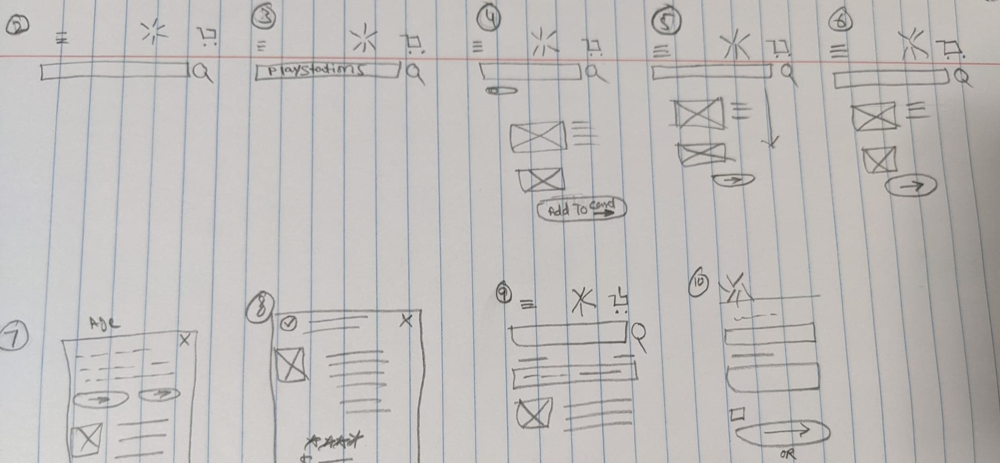
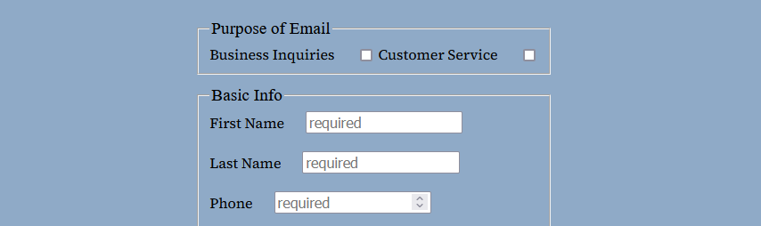

# codejournal
this is simple journal.

## Jan 12,2022
Goal: write a code journal
* First try to write a journal. looking good.I created a repo named:codejournal and added file README.md by git add . I was not able to copy link to my terminal. I asked for help from tony. Then i made some changes init checked my status  using git status and then i pushed it to github by Git push.

* i thought it worked looks like im stuck
* omg i dont know what to do
* i forgot to save the file so git did not see any changes
* yea i got it

Goal: giving a theme 
* just looked up for some basic syntax to make my journal pretty.I am hoping i don't make any mistakes there.

* forgot to save again ahhhh

Goal: working on webpage

* Just created a folder "hello"
* Added a file "index.html"
* Having some trouble adding my code in terminal
* My folder "hello" was not on my github so i was having problem
* I got help from tony
* Used git init created a repository
* Added ssh keys
## Jan 17/2022-20/2022
Goal: working on agile ux breakdown

* Looking for mobile app.
   * Created a new repo name `dsgn270-a1` on GH
   * Cloned the repo to my local directory ->`git clone` [dsgn--a1](https://github.com/maryambkhan/dsgn270-a1.git)
   * Added README.md file `git add .`
* Still thinking of good scenario to write user story
* I just figured out my user story
* I am going to write about `wallmart`
* I have created a rough sketch of my user story on paper
* Now I am going to add it to my repo `dsgn270-a1` 
* I just set `##H heading` and git add . ,git commit -m"" and git push. As always no changes becouse i was not in right file.
*  I just finished writing `user story` and `userflow`.
* I had some trouble with formiting my markdown but i figured it out finally[markdown cheatsheat](https://github.com/adam-p/markdown-here/wiki/Markdown-Cheatsheet#lists )

* I was looking for solution how to add picture in markdown
i found this [image](https://stackoverflow.com/questions/41604263/how-do-i-display-local-image-in-markdown )worked for me.

Goal:WireFrame

* Started working on wireframe.
* Finished with rough idea of wireframe 
    * Have to draw fine one
    * Have to edit in figma 
* This is what i have done so far: 

**Self-Assessment:**

*  My first day of class was not good at all.
     * I had no expectations from my self.
     * I was stressed.
*  Now I am doing good. 
     * I am not behaind at anything.  
     * I understand git.
*  My goal is that at the end of the day i have practiced enough what i have learned.
*  I have problem reading i cant concentrate. I want to over come it and spare an hour daily.
*  I am assessing my self on the work i have done past week include ( labs,assignment,extra excersise).
*  I liked the self-assessment part.
     * I think i am going to do this on weekly base.

*  Today in lab time played with some `hsl` color and `font` style.
*  Used some `hsl` color from:[hsl-color](https://coolors.co) .
* Just finished my assignment `dsgn270`.
* Good day today.

## **Jan/20-21/2022**

Goal: Working on HTML and CSS

* We practiced working on `HTML` and `css`.
* It went fine eccept i was not able to see changes becouse i needed to confirm my email.
* Today in lab time  me and Stephan worked on `wiki article`.
   * We choose an article from `lord of the rings`.
   * Put some paragraph in `html` and headings and applied some `css` on it.
* I had some trouble understanding new syntax.
   * I know some old fashiond html.Its confusing sometime.
  *  But after some practicing will get use to it.
* Well at the end of lab time we were done with our assignment 
* Looked nice .
* Link to my work: [codepen](https://codepen.io/maryambkhan/pen/zYEVoOE)
* `<article>`tag, i did not uderstood this but ashlyn helped us.
* Kind of understand it. 
* But I found an article about it gonna read later :[Html](https://developer.mozilla.org/en-US/docs/Web/HTML/Element/article)
* I just `commited` this update and `pushed` it to github guess what nothing happend.
* Becouse i forgot to save.Allways !!!!!
* Wanted to practice more and apply`<article>`tag in codepen, so decided to work some more on `lord of the rings` pen.
  * Got some help from here too:[html,css](https://www.w3schools.com/tags/tag_article.asp)
  * Like the result
   [wiki assignment](https://codepen.io/maryambkhan/full/zYEVoOE)
* Learn responsive web design.

 ## Jan/24/2022
 Goal: Nav bar
* created a new codepen named it nav-bar.
* Created a list .
   <nav>
    <ul class="nav-link">
        <li>Home</li>
        <li>Work</li>
        <li >Contact</li>
        <li>About</li>
    </ul>
   </nav>
*  Did some css style.
*  Used some help from `mozilla.org` and `w3school`.
*  I am still having problem with aligning the nav elements.
*  [nav bar](https://codepen.io/maryambkhan/pen/VwMoxZK?editors=0110)
*  Had some issues when i was trying to push code to GH but figuerd it out was not 
   using right process.
*  Nav elements does not have purpose yet.
*  Have to do some designing and give it a purpose.
*  After so many try i can not figuerd it out to fix it.
*  I started looking for solution i found something here:[w3school](https://www.w3schools.com)
   <nav>
     <ul>
      <li><a href="#">Home</a></li>
      <li><a href="#">About</a></li>
      <li><a href="#">Work</a></li>
      <li><a href="#">Contact</a></li>
     </ul>
   </nav>
*  It works and i understand it too but still want to find the solution for other way i was doing it.
*  I think i am gonna ask for help.
*  Fixed the nav bar yea!
    `flex-wrap:wrap;`

    ## Jan 27/2022-28/2022

    Goal : 404 Error Page
    
    * Add background image
    * write text on it
    * Found nice image to add
    * No troubles with code
    * Took me forever to find  an image

    Goal : Grid CSS

    * Had trouble understanding at first
    * Grid Design:
    * Result : 
    * Still need practice

    Goal : Working on form

    * Photography page
    * Checkbox
    * Formfield :
      *  first  name
      *  last name
      *   email
      *   phone
      *  feedback
    * Drop down options(wedding,party,potraite)
    * Done with form need some semantics to do.
    * Can't fix the field in right position
    

    Goal : Assignment2

    * Have started working on it
    * Going to add hero section image
    * Nav bar mobile menu
    * Least 3 cards
    * Services column
    * Already added nav bar and hero section image
    * Had problem with hero section image becouse of size not sure if i am going to keep it 
    * Working on card now
    * Finished with card had trouble with aligning cards in row used grid css
    * I can't seem to add any more thing in my page i have no idea y?
    * I want to add text but no space annoying
    * Figured that out but can't seem to find why my cards are overflowing
     
     ## Feb 1/2022-4/2022

   Goal : Assignment3

   * Plan: 
   * I have aligned images as i planed it was little tricky but did it
   * Used lots of div  and used this method: 
   * Next step to add social media icons and navigation bar and make it responsive page
   * Had to change this method too becouse i delared images as fixed in rows and columns 
      so was having problem making page responsive.
   * My page is looking good eccept:
   * Had to make nav bar responsive without @media had some problems with container but figured it out now stuck with logo overlap
   * One more problem icons i did it before don't know y not working this time have to check some sources out my mostly sources are mdn, ww3school and kevinpowell youtube.

   Goal : Assignment4

   * Created repo named cpnt260-a4
   * Added files and folders
   * created nav bar
 
 ## Feb 7/2022

 ## Plugin Away

    * Downloded `fullpage.js` 
    * Extrected the zip file in my workspace
    * Next step is  for demo

  ## Mar 15/2022- Mar 20/2022

  ### Logo Design

     - I wanted crate a logo for photography website so this is what i colleted:
       

 - Ahhhh making logo is so hard i have tired to work on one image from my moodboard 
   i have got one done but i dont like it.
     
     

 - I have ideas what i want to do but implementation is hard.This was realy a challenge for me
 - Having problem using pen
 - Well i have got some messy work done but i think thats all i can do for now need more practice
 - I wanted to incoprate text with my logo just cant figure out how so i am going to proced to next step
  if i have time left will try that again

 - I tried to create 4 of these but this is what i could get
 - let's see my mood board 

  

 - In my updated moodboard i have got image, its so silly idea i dont even know why i added this in there.
   while i was working on it just hit me so i just put in on canvas LOL
 - Ok time for  clean up and start coding
 - So i started exporting from figma i was having problem with `width and height` of the logo and i had too many paths so i used boolean groups. After that i had to change width and height in `svgomg` too. 
- When i was done with logo design then css styling was real simple
- Well great learning experience once i understood tools and little things it was preaty good to work on
- I am still having problem with image part it is not shrinking need check that out

### Figma Mockup

- I am working on `sephora's` website for mockup. I choose there website becouse they have 
   lots going on on there site it would be good for prototype assignment.
- I created a library where i set colors and fonts, I found colors from there site and set them as style
   but i couldint fint any font they are using so i just found somthing similar.

    

- Now i am going to start working on designing the site.
- I have completed 2 nav bars (local and global) and i have put hero section image.
- It is looking good next i am working on product/card.
- I finished designing cards and already started working on footer.
- When i started working on footer i wanted to increase the length of card so i did that 
  when i scrolled up globel navigation was broken took me some time to fix it.
- I am almost done with footer and then my assignment will be done if no problem.

     

### Figma Prototype

- I have copied the landing page from dsgn270-a4 and
   started new project dsgn270-a5.

- Plan:
    - Components:
        - Global nav-bar
        - Local nav-bar
        - Sign in button
        - Show more button
        - Card
- I have created a home page and atteched all the components to it
- Created second page Navigating to `new` page and this page has all the 
  available new products i wanted to add more products to it like when i click 
  see more then i can see more products but i cant figure out how to add two properties 
  to one component
- It looks clean and simple i like it, i CAN still see some silly mistakes
  need more practice but i this looks nice
- On third page `makeup` i posted cards with more makeup products and a poster with 
  call to action.
- I made more components on the way as i needed them `jessica's demo` helped me with creating these 
  little components and re using them.
- I wanted to go for simple design and make the site easy and accessable for user i tried to use more color
  to make site colorfull as it is a cosmetics website. I think did not overdo with the colors
- Mostly i wanted to use as much as  different prototype i could use

- Creating nav bar was so hard i had to do same thing over and over so many time
  i wish i can find something easy then this
- It was real nice experience i liked it i learnend so much stuff mostly 
- How to start creating a website why we need to design a site.
    

### Sources

- [Nuxt3](https://v3.nuxtjs.org/getting-started/bridge)
- [Nuxt2](https://nuxtjs.org/)
- [Storyblok](https://www.storyblok.com/mp/storyblok-meets-vue3-nuxt3)
- [Tailwindcss](https://tailwindcss.com/docs/installation)
- [Tailwindcss Nuxtjs](https://tailwindcss.nuxtjs.org/tailwind/config)
- [Vue](https://vuejs.org/)
- [nuxt3 guide](https://v3.nuxtjs.org/docs/directory-structure/components/)
- [Eslinter](https://eslint.vuejs.org/user-guide/#usage)
- [Svgomg](https://jakearchibald.github.io/svgomg/)
- [Netlify](https://app.netlify.com/teams/maryambkhan/overview)
- [Gist](https://gist.github.com/lilyx13/59068feba277c73cc2a4be7a15ec6f59)

